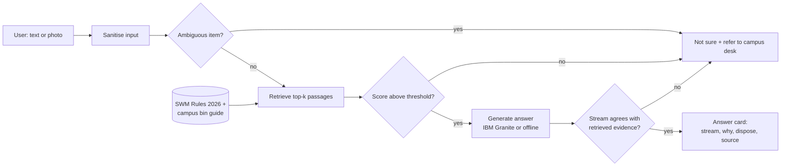

# ♻️ EcoSort Campus

**An AI assistant that tells students and staff which of the four waste streams an item belongs to, with the reason and the source.**

Built for the **1M1B × IBM SkillsBuild × AICTE – AI for Sustainability Virtual Internship (July–Sep 2026)**.

| | |
|---|---|
| **Author** | [Your Name], [College Name] |
| **Primary SDG** | SDG 12: Responsible Consumption and Production |
| **Secondary SDGs** | SDG 11: Sustainable Cities and Communities · SDG 13: Climate Action |
| **AI components** | Prompt engineering · Retrieval-Augmented Generation (RAG) · IBM Granite models · IBM Bob (build time) · optional multimodal (photo) input |
| **Live website** | Single-file static site in [`docs/index.html`](docs/index.html), deployable free on GitHub Pages (see section 5) |
| **Presentation** | [`docs/EcoSort_Campus_AI_Sustainability_Project.pptx`](docs/EcoSort_Campus_AI_Sustainability_Project.pptx) |

---

## 1. Problem statement

> **How might we use AI to help students and staff segregate campus waste correctly at source so that campus waste management can become more sustainable?**

India's Solid Waste Management Rules, 2026 (in force from 1 April 2026) make **four-stream segregation at source mandatory**: **wet, dry, sanitary and special care** waste. Many people learned only "wet and dry", the legal text is long, and static posters cannot answer *"what about this item?"* at 11 pm. Mixed bins contaminate recyclables and send organic waste to landfill.

**Target users:** students and hostel residents · canteen and housekeeping staff · campus sustainability team.

## 2. What it does

* Type an item ("used tea bag") and get **one stream, a one-line reason, how to dispose of it, and the source**.
* **Grounded answers only**: the assistant answers from its knowledge base (SWM Rules 2026 + a campus bin guide), never from memory.
* **Honest fallback**: if the item is not covered, or its stream depends on condition or local rules, it says **"Not sure"** and refers the user to the campus sustainability desk.
* **Privacy by design**: no login, personal data typed by mistake is stripped, photos stay in memory, and feedback is stored as three anonymous counters.
* Works **offline with no API key** (great for demos) and upgrades to **IBM Granite** through watsonx.ai or Ollama.

### Example

```text
$ python -m ecosort.cli "broken tube light"

  Item   : broken tube light
  Stream : SPECIAL CARE
  Why    : Bulbs and tube lights are special care (household hazardous) waste.
  Dispose: Do not mix it with wet or dry waste. Hand it over at a designated special care waste collection point.
  Source : Campus bin guide (sample - edit for your campus)

$ python -m ecosort.cli "old phone charger"

  Item   : old phone charger
  Stream : NOT SURE
  Why    : I could not find this item in my sources, so I will not guess.
  Dispose: Please ask the campus sustainability desk.
  Source : -
```

## 3. How it works



Details and extension points are in [`docs/architecture.md`](docs/architecture.md).

## 4. Quick start

Requires Python 3.10+.

```bash
git clone https://github.com/<your-username>/ecosort-campus.git
cd ecosort-campus

python -m venv .venv
source .venv/bin/activate          # Windows: .venv\Scripts\activate
pip install -r requirements.txt

# Web app
streamlit run app.py

# or the command line
python -m ecosort.cli "banana peel"
python -m ecosort.cli                 # interactive chat loop
```

No key or model is needed for the default `offline` mode.

### Using IBM Granite

Copy `.env.example` to `.env` (or `.streamlit/secrets.toml.example` to `.streamlit/secrets.toml`), then choose one provider. No credits are needed for offline mode. See **[Do I need credits?](#5-do-i-need-credits-or-keys)** below.

**A. IBM watsonx.ai** (works on Streamlit Community Cloud)

```bash
pip install -r requirements.txt
# .env
LLM_PROVIDER=watsonx
WATSONX_API_KEY=...
WATSONX_PROJECT_ID=...
WATSONX_MODEL_ID=ibm/granite-4-h-small   # use the exact Granite model ID shown in your watsonx.ai account
```

**B. Local Granite through Ollama** (your computer only)

```bash
ollama pull granite3.3:8b
# .env
LLM_PROVIDER=ollama
OLLAMA_MODEL=granite3.3:8b
```

If keys or the SDK are missing, or a model call fails, EcoSort automatically falls back to offline mode and says so in the answer note. Repeated items are cached and `LLM_DAILY_CAP` (default 25) limits model calls per day, which protects a free quota.

> The watsonx.ai, Ollama and photo-mode code paths follow the vendors' documented APIs (the watsonx SDK signatures were checked against the installed package) but were **not run against live services** while this repository was written. Test them with your own account. The offline mode, quota logic, tests and evaluation were run.

### Photo input (experimental)

Upload a photo in the web app. It is sent to a vision model served by Ollama (`VISION_MODEL`, default `granite3.2-vision`), turned into an item name, and then goes through the same pipeline. The photo is never written to disk.

## 5. Do I need credits or keys?

| Piece | Needed to run or deploy? | Cost |
|---|---|---|
| **IBM Bob** | **No.** It is a build-time tool and the app never calls it. Use it during development and keep screenshots as evidence. | 30-day free trial with a small Bobcoin allowance, then paid plans from about $20 per user per month. See <https://bob.ibm.com/trial>. |
| **IBM Granite** | **No.** Offline mode works with no keys. Add Granite for model-written answers. | watsonx.ai free plan: up to 300,000 tokens a month. Or run locally with Ollama for free. |
| **GitHub, GitHub Pages, Streamlit Community Cloud** | Accounts only | Free |

Full details, limits and setup steps: **[`docs/DEPLOYMENT.md`](docs/DEPLOYMENT.md)**.

## 6. Deploy

1. **Website**: GitHub Pages, branch `main`, folder `/docs`. No keys.
2. **Live app**: <https://share.streamlit.io> → Create app → this repo, branch `main`, file `app.py` → Advanced settings → paste your secrets (or none for offline mode).

Step-by-step instructions, including how to get watsonx.ai credentials and link the website to the app, are in [`docs/DEPLOYMENT.md`](docs/DEPLOYMENT.md).

## 7. Website (GitHub Pages)

The repo includes a complete, single-file website: `docs/index.html`. It has the interactive assistant (four bins that open when an item is sorted), the four streams, how an answer is made, the Bob and Granite story, and the Responsible AI section. It uses a JavaScript port of the same retrieval pipeline, so it runs entirely in the browser with **no server and no API key**. Nothing a visitor types leaves the page.

**Deploy it free with GitHub Pages**

1. Push the repo to GitHub.
2. Go to **Settings → Pages**.
3. Under **Build and deployment**, choose **Deploy from a branch**, select `main` and the **`/docs`** folder, then **Save**.
4. After a minute, your site is live at `https://<your-username>.github.io/ecosort-campus/`.

**Rebuild after editing the knowledge base**

```bash
python scripts/build_site.py      # regenerates docs/index.html from site/ and data/
node scripts/check_engine.js      # confirms the JS engine still passes the evaluation set
```

The website runs the *offline* mode. The Granite-powered mode needs the Python app (`streamlit run app.py`), which can be hosted on Streamlit Community Cloud, Render or any server that can run Python.

## 8. Project structure

```text
ecosort-campus/
├── app.py                      # Streamlit web app
├── ecosort/
│   ├── pipeline.py             # sanitise → retrieve → gate → generate → validate
│   ├── retriever.py            # TF-IDF retrieval (swap for embeddings)
│   ├── knowledge.py            # loads the knowledge base
│   ├── prompts.py              # the system prompt
│   ├── llm.py                  # offline / Ollama / watsonx.ai responders
│   ├── privacy.py              # strips e-mails and phone numbers
│   ├── feedback.py             # three anonymous counters
│   ├── vision.py               # optional photo → item name
│   ├── config.py               # settings from environment
│   └── cli.py                  # command-line interface
├── data/knowledge_base.json    # rules + sample campus guide (edit this!)
├── site/                       # website source: template.html + engine.js (JS port of the retriever)
├── scripts/                    # build_site.py, check_engine.js
├── eval/                       # test items and scoring script
├── tests/                      # pytest suite
├── docs/                       # index.html (website), architecture, responsible AI, Bob workflow, slide deck
├── .github/workflows/tests.yml # CI: tests + evaluation on every push
├── .streamlit/                 # theme + secrets.toml.example (for Streamlit Cloud)
├── requirements*.txt · .env.example · LICENSE
```

## 9. Customise for your campus

Edit `data/knowledge_base.json`. Each chunk has:

```json
{
  "id": "wet-tea",
  "stream": "Wet",
  "title": "Tea bags, tea leaves and coffee grounds",
  "keywords": ["tea bag", "tea leaves", "coffee grounds"],
  "why": "Tea and coffee residue is organic kitchen waste.",
  "dispose": "Put it in the wet waste bin so it can be composted or processed through bio-methanation.",
  "source": "Campus bin guide"
}
```

Add your own items, your local bin colours and your campus contact. Items whose stream depends on condition go in the `"ambiguous"` list so the assistant never guesses.

## 10. Where IBM Bob fits

**IBM Bob** is used as the AI development partner at *build time*: planning the architecture, generating and reviewing code, drafting test cases, and writing documentation. **IBM Granite + RAG** is the AI users interact with at *run time*. A human reviews everything Bob produces.

Ready-to-use Bob prompts and a session log template are in [`docs/bob_workflow.md`](docs/bob_workflow.md). Add your own screenshots and notes there so reviewers can see exactly how you used Bob.

## 11. Responsible AI considerations

| Principle | In this project |
|---|---|
| **Fairness** | Plain language, no login, free to use. Extend the knowledge base with items from many regions and households and test them. |
| **Transparency** | Every answer shows the stream, reason and source. An expander shows retrieved passages and the retrieval score. |
| **Ethics** | Advisory only; no monitoring or penalising of people. Hazardous or ambiguous cases go to a human. No medical advice. |
| **Privacy** | No accounts. E-mails and phone numbers are stripped. Photos stay in memory. Feedback is three integer counters. |

More detail and known limitations: [`docs/responsible_ai.md`](docs/responsible_ai.md).

## 12. Testing and evaluation

```bash
pip install -r requirements-dev.txt
pytest -q                     # 34 tests
python eval/run_eval.py       # scores eval/test_items.csv
node scripts/check_engine.js  # same evaluation for the website's JS engine
```

Current offline result on the bundled 43-item set: **43/43 correct, 0 confidently wrong** (33 in-scope items and 10 deliberately out-of-scope items that must return "Not sure").

**Read this number with care.** The set is small, was written by the author while building the system, and the offline mode is keyword-based, so the score is optimistic. The useful signal is the design: a wrong stream given with confidence fails the evaluation script. Grow the set with real questions from a pilot before trusting any figure.

## 13. Known limitations

* The knowledge base is a **sample**; verify it against your municipality's rules and bin colours.
* Keyword retrieval does not handle misspellings, slang or non-English item names yet.
* Photo mode is experimental.
* Not legal or compliance advice.

## 14. Roadmap

- [ ] Embedding-based retrieval (Granite embedding models) with TF-IDF fallback
- [ ] Multilingual answers (Hindi, Kannada and other local languages)
- [ ] Pilot in one hostel or canteen with before/after bin audits
- [x] Static website on GitHub Pages
- [x] Streamlit Community Cloud deployment with daily quota protection
- [ ] Admin view of anonymous counters to spot confusing items
- [ ] Re-point the knowledge base to other cities' rules

## 15. Sources

* PIB / MoEFCC: *New Solid Waste Management Rules Notified; to come into force from April 1, 2026*: <https://www.pib.gov.in/PressReleasePage.aspx?PRID=2219676&reg=3&lang=1>
* IBM watsonx.ai pricing (free plan and Granite model prices): <https://www.ibm.com/watsonx/pricing>
* IBM Bob free trial: <https://bob.ibm.com/trial>
* Streamlit Community Cloud deployment and secrets: <https://docs.streamlit.io/deploy/streamlit-community-cloud/deploy-your-app/deploy>
* Knowledge-base definitions paraphrase the four-stream summary above. Item-level guidance is a sample written for this project.

## 16. License

MIT. See [`LICENSE`](LICENSE). Replace `[Your Name]` with your name.
