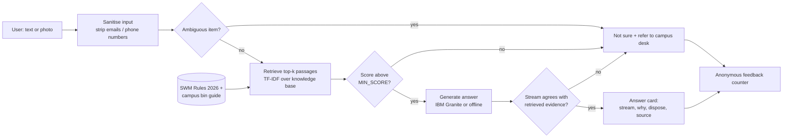

# Architecture

## Components

| File | Role |
|---|---|
| `ecosort/privacy.py` | Removes e-mail addresses and phone numbers, caps input length |
| `ecosort/retriever.py` | TF-IDF retriever with light plural normalisation and stop-word removal |
| `ecosort/knowledge.py` | Loads `data/knowledge_base.json` into typed chunks |
| `ecosort/prompts.py` | The system prompt shown on the "prompt workflow" slide |
| `ecosort/llm.py` | Pluggable generators: offline, Ollama (Granite), watsonx.ai (Granite) |
| `ecosort/pipeline.py` | Orchestrates the steps and enforces the guardrails |
| `ecosort/feedback.py` | Stores three integer counters only |
| `ecosort/vision.py` | Optional photo-to-item-name step (experimental) |

## Three guardrails, in order

1. **Ambiguity list**: items whose stream depends on condition or local rules (used tissue, greasy pizza box, plastic-lined cups, masks) are never guessed.
2. **Confidence gate**: if the best retrieval score is below `MIN_SCORE`, the answer is "Not sure".
3. **Evidence check**: the stream the model returns must be one of the streams present in the retrieved passages, otherwise the answer is "Not sure". A model that invents a category cannot get through.

## Extending

* **Better retrieval**: replace `Retriever` with an embedding-based version (for example a Granite embedding model). Keep the `search(query, k)` signature.
* **More knowledge**: add chunks to `data/knowledge_base.json` (fields: `id`, `stream`, `title`, `keywords`, `why`, `dispose`, `source`).
* **Local languages**: add translated `keywords` and `why` / `dispose` text per chunk, or translate the answer with the model.
